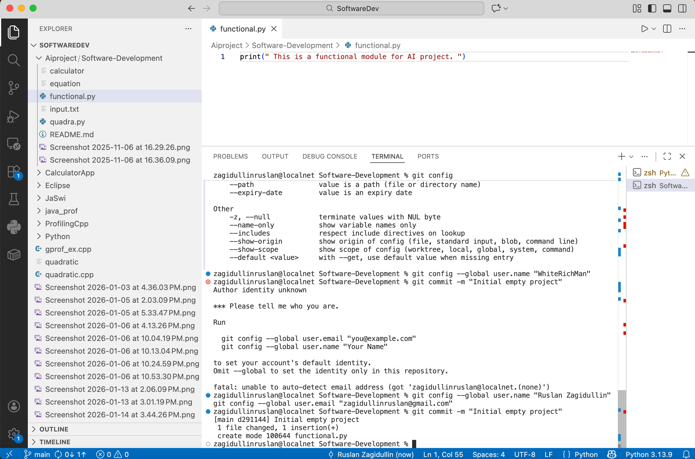

<h3>Hello 👋 I'm Ruslan Project manager here my GIT – Short Report💻</h3>


# Software-Development
# GIT – Short Report


**Language:** Python  
**IDE:** VS Code  
**Git server:** GitHub / GitLab  

This report describes all required Git operations performed using a local project and a remote repository.
All actions were done using both terminal and IDE Git tools.

---

## a) Create remote repository
A remote repository was created on GitHub/GitLab.  
It is used to store the project online.

---

## b) Clone the empty repository
The remote repository was cloned to the local machine.

Command used:
```bash
git clone <repo-url>

## c) Create empty local project

An empty Python project was created inside the cloned repository.

---

## d) Commit the whole project

The initial project structure was saved to Git history.

**Commands used:**

git add .
git commit -m "Initial empty project"

<p align="center">
  
</p>

----

## e) Add simple code (create table)

Simple Python code was added to create a table (list).

table = [0] * 10
print(table)

screen 2

---

## f) Commit changes

The added code was saved as a new commit.

**Command used:**

git commit -am "Create table"

Screen 3

---

## g) Initialize table with random values

The table was filled with random numbers.

import random
table = [random.randint(0, 99) for _ in range(10)]
print(table)

Screen 5

---

## h) Commit changes

The changes were committed.

**Command used:**

git commit -am "Initialize table with random values"

Screen 4

---

## i) Sort table elements

Sorting of table elements was added.

table.sort()
print(table)

Screen 4

---

## j) Commit changes

Sorting functionality was committed.

**Command used:**

git commit -am "Sort table elements"

Screen 5

---

## k) Look at code history

Commit history was checked.

**Command used:**

git log

Screen 6 

---

## l) Look at code annotations

Line-by-line code history was checked.

**Command used:**

git blame funvtional.py

Screen 7

---

## m) Checkout different revisions

Different versions of the project were checked.

**Commands used:**

git checkout <commit-id>
git checkout main

Screen 8 

---

## n) Add changes without commit

The code was modified but not committed.

---

## o) Revert last changes

Uncommitted changes were reverted.

**Command used:**

git restore main.py

Screen 9

---

## p) Push project to remote repository

All commits were uploaded to the remote repository.

Command used:

git push origin main

Screen 10 

---

## r) Delete local project and repository

The local project and repository were removed.

Screen 11

---

## s) Clone project again from remote repository

The project was cloned again from the remote repository.

**Command used:**

git clone <repo-url>

Screen 12

---

## t) Create tag and switch between tag and main

A tag was created to mark a project version and switching was tested.

**Commands used:**

git tag v1.0
git checkout v1.0
git checkout main

Screen 13

---

## u) Create new branch from main

A new branch was created from the main branch.

**Commands used:**

git branch improvement
git checkout improvement

---

## w) Switch to branch

Work was continued in the new branch.

**Command used:**

git checkout improvement

---

## x) Improve code in branch

The sorting algorithm was improved in the branch.

table = sorted(table, reverse=True)
print(table)

**Command used:**

git commit -am "Improve sorting algorithm"

---

## y) Merge branch into master

Changes from the branch were merged into the main branch.

**Commands used:**

git checkout main
git merge improvement

Screen 14 

---

## z) Share repository with a friend

Repository URL was shared and access permissions were granted.

---

## z1) Produce conflict

A conflict was produced when two users edited the same file.

---

## z2) Solve conflict and push solution

The conflict was resolved manually and pushed to the remote repository.

**Commands used:**

git add .
git commit -m "Resolve merge conflict"
git push

---

## z3) Send repository URL to teacher

The repository URL and short report were sent to the teacher by e-mail.
Teacher access to the repository was enabled.

---

## Additional Git commands used
git status
git branch
git tag
git pull


<h2>Languages for tasks🌐 </h2>


